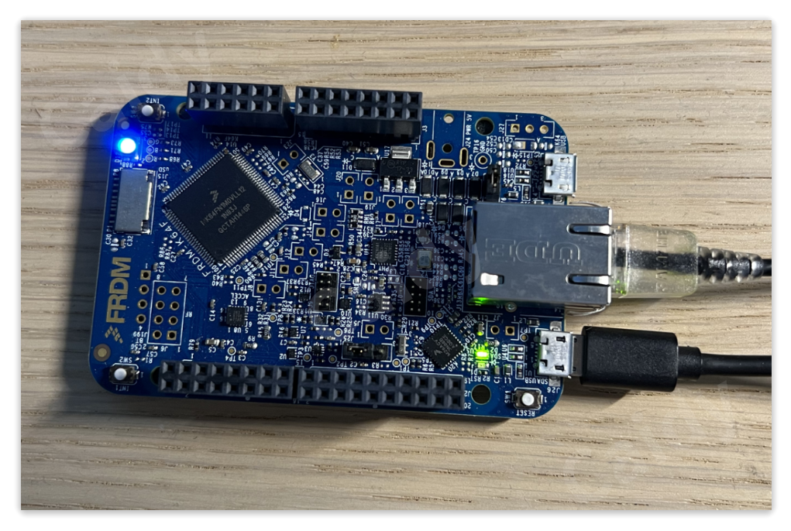

# IEEE1588v2 PTP time server for FRDM-K64F

## Overview

## Progress

| Feature | Support |
|:--------|:-------|
| HW Timestamp | YES |
| LwIP Stack | YES |
| ICMP Timestamp Reply | YES |
| PTPd | YES |
| GPS PPS Input | WIP |
| 1PPS Simulation | WIP |
| Web Control Panel | WIP |
